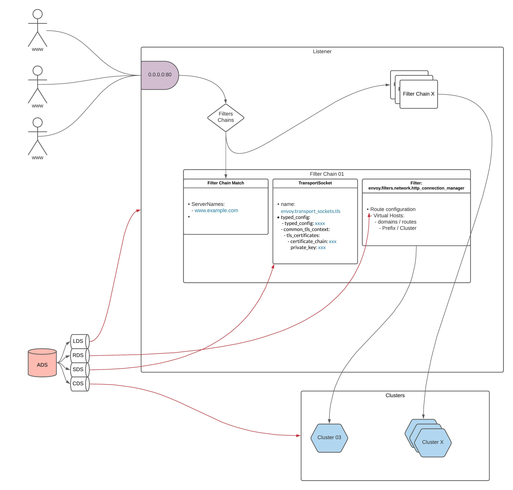
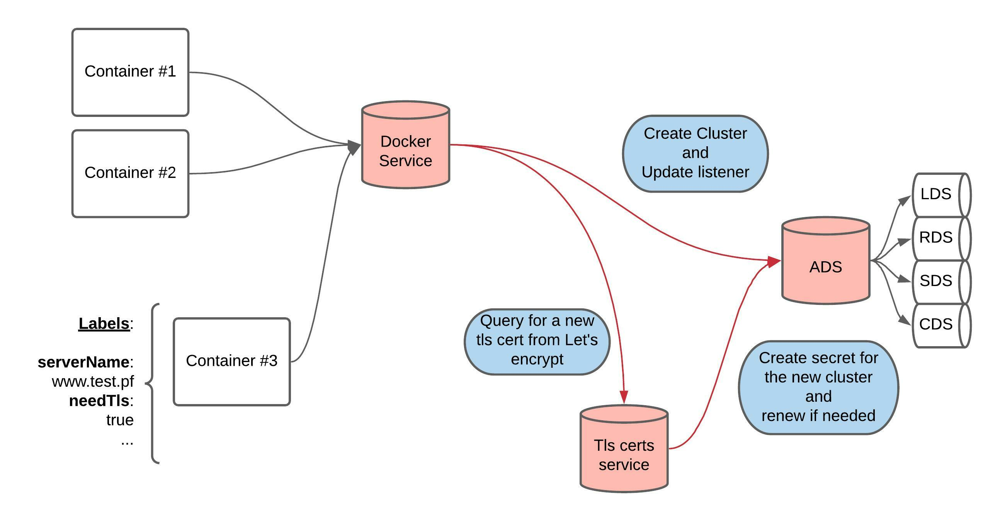

Envoy Java control plane
========================

A simple draft of a Java control plane for Envoy proxy.    
Build on Springboot.  
Put this draft here, because there is not enough java example for Envoy Control Plane.  
Hope that can help someone :D

Try and build this project over the [NexClipper/RomeWay](https://github.com/NexClipper/RomeWay) project.
Envoy [config](/assets/static-conf.yaml) is available in the [asset](/assets) folders along of a [Postman export](/assets/Configure%20Envoy.postman_collection.json).

Goal: Try to understand and create a service to control my Envoy proxy and be connected to other service that manage my Docker containers environment and serve TLS Let's encrypt cert with auto renewal. Like [Traefik](https://doc.traefik.io/traefik/), can configure Envoy proxy with container label via this service.

